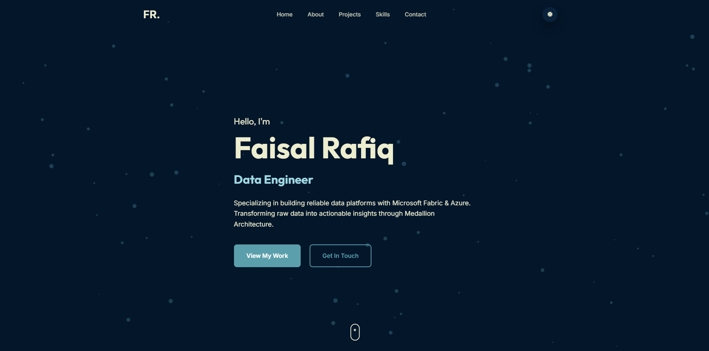

# Faisal Rafiq - Data Engineer Portfolio

A professional, high-performance portfolio website showcasing data engineering expertise in Microsoft Fabric, Azure, and Medallion Architecture.

## 🚀 Live Demo
<p align="center">
  <a href="https://faisalrafiq031.github.io/" target="_blank">
    
  </a>
</p>




## 🛠️ Technical Experience
- **Cloud Platforms**: Microsoft Fabric, Azure (Blob Storage, Data Services)
- **Data Engineering**: Medallion Architecture (Bronze/Silver/Gold), ETL/ELT Pipelines, Incremental Loads
- **Programming**: PySpark, Python (Pandas, NumPy), SQL
- **Analytics**: Power BI, Star Schema Modeling, DAX

## 💻 Tech Stack (Frontend)
- **Structure**: Semantic HTML5
- **Styling**: Vanilla CSS3 (Custom Design System)
- **Logic**: Vanilla JavaScript (ES6+)
- **Animations**: Canvas API for particle effects, Intersection Observer for reveal animations
- **Contact**: Integrated via Formspree API

## ✨ Key Features
- **Dark Mode Default**: Premium dark aesthetic with a manual light mode toggle.
- **Interactive Background**: Dynamic particle system on the hero section.
- **Antigravity Popper Effect**: Custom particle explosion on user clicks.
- **Glassmorphism UI**: Modern transparent project cards with backdrop filters.
- **Fully Responsive**: Optimized for all devices (Mobile, Tablet, Desktop).
- **SEO Optimized**: Meta tags and structured content for search engine visibility.

## 📂 Project Structure
```text
├── index.html      # Main structure and content
├── style.css       # Design system and responsive layouts
├── script.js       # Interactive animations and theme logic
└── README.md       # Project documentation
```

## 📬 Contact
- **Email**: [frafiq031@gmail.com](mailto:frafiq031@gmail.com)
- **LinkedIn**: [linkedin.com/in/faisal-rafiq-159040269/](https://www.linkedin.com/in/faisal-rafiq-159040269/)
- **GitHub**: [github.com/faisalrafiq031](https://github.com/faisalrafiq031)


